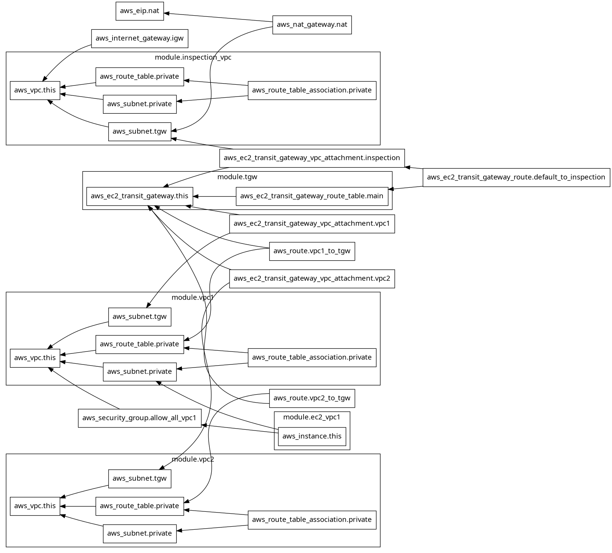

# AWS Multi-VPC Transit Gateway Architecture (Arch-01)

## Graph View
```
terraform graph -type=plan | dot -Tpng > graph.png

```



## Overview

This project provisions a multi-VPC AWS network architecture using Terraform, featuring:

* Multiple application VPCs
* Centralized Transit Gateway (TGW)
* Inspection VPC for controlled egress
* NAT Gateway for internet access
* Modular and reusable Terraform structure
* Environment-aware safeguards (`prevent_destroy` for production)

---

## Architecture

### Traffic Flow

```
EC2 (VPC1)
  → Private Route Table
  → Transit Gateway
  → Inspection VPC
  → NAT Gateway
  → Internet
```

### Inter-VPC Communication

```
VPC1 ↔ TGW ↔ VPC2
```

---

## Project Structure

```
infra/
├── main.tf
├── variables.tf
├── terraform.tfvars
│
└── modules/
    ├── vpc/
    ├── tgw/
    ├── ec2/
```

---

## Modules

### VPC Module

* Creates VPC, subnets (private + TGW)
* Configures route tables
* Outputs subnet IDs and route table IDs

### TGW Module

* Creates Transit Gateway
* Disables default route propagation for control
* Provides TGW route table

### EC2 Module

* Launches test instances
* Used for connectivity validation

---

## Key Concepts

### 1. Dedicated TGW Subnets

TGW attachments require specific subnets. These act as controlled entry/exit points for traffic.

### 2. Centralized Routing

All outbound traffic from application VPCs is routed through:

* TGW
* Inspection VPC
* NAT Gateway

### 3. Environment Safety

```hcl
changed to prevent_destroy = false

from prevent_destroy = var.environment == "prod"
```
Sice Terraform dosen't allow to pass this parameter during runtime

Prevents accidental deletion of:

* VPC
* Transit Gateway

---

## Deployment

### Initialize

```bash
terraform init
```

### Plan

```bash
terraform plan
```

### Apply

```bash
terraform apply
```

### Destroy (Non-Prod Only)

```bash
terraform destroy
```

---

## Validation

After deployment:

1. SSH into EC2 instance
2. Test:

```bash
ping <private-ip-of-other-vpc>
curl google.com
```

---

## Limitations (Intentional)

This is a baseline architecture. It does NOT include:

* AWS Network Firewall
* Multi-AZ high availability
* Logging (VPC Flow Logs)
* IAM hardening

---

## Next Improvements

* Add Inspection VPC firewall (AWS Network Firewall)
* Multi-AZ NAT Gateway
* Centralized logging
* Route table segmentation (pre/post inspection)

---

## Notes

* This architecture prioritizes clarity over abstraction
* Designed for learning + extension into production systems
* Avoid adding complexity before validating traffic flow

---

## Author Intent

This project is built to:

* Understand AWS networking deeply
* Learn Terraform module design
* Simulate production-grade routing patterns

---

## License

MIT
